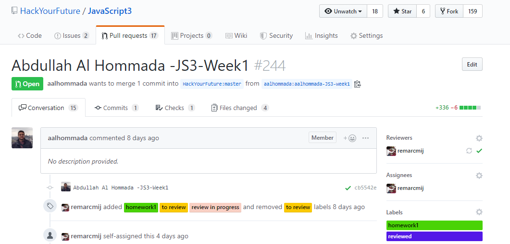

# Homework Review Process

This write-up documents the homework review workflow that I (Jim Cramer, @remarcmij) use when reviewing homework submitted as GitHub pull requests for the JavaScript 2 and 3 modules.

When I'm assigned to teach a module I set myself up to **Watch** ('Be notified of all conversations') the corresponding repo on the HYF GitHub organization account, so I get notified when Pull Requests come in and again when they are updated. (I generally **Unwatch** when done teaching.)

If there are still PRs from a preceding class I close them so we can start with a blank slate.

When a new PR comes in then, if not done already, I add the GitHub label `homeworkN` (where `N` is 1, 2 or 3) and the label `to review` to the PR.

I generally start my reviews on the Friday (in the JS modules we have set the deadline for the PR on Thursday evening, although only a portion of the students will meet that deadline). I continue the reviews on Saturday, but anything coming in on a Saturday night or Sunday morning will not get a timely review.

Then, for each PR, starting from the bottom (oldest PR) working up (newer PRs) I follow these steps:

1. I select the PR from the list and assign myself as Assignee, and change the label `to review` to `review in progress`. This to ensure that fellow mentors helping out with reviews do not start on the same PR. (Of course, I'm expecting fellow mentors to do the same).

2. Then I open the student's GitHub repo in a new browser tab (by clicking on his/her PR branch, `aalhommada-JS3-week1` in Figure 1 below) to clone their corresponding repo to my local machine. I maintain a separate folder for each class, and within that folder, a subfolder for the module (`js2`, `js3`). When cloning a student repo I override the default repo name with the GitHub name of the student, say `aalhommada`:

   

   **Figure 1**: Example pull request.

   ```
   hackyourfuture/
    class12/
      js2/
      js3/
         aalhommada/
   ```

   **Figure 2**: Folder structure for reviewing homework.

3. Next I open the student repo with VSCode and checkout the branch that the student used for the PR (e.g., `aalhommada-JS3-week1`).

4. I open up a terminal window in VSCode and install any dependencies:

   ```
   npm install
   ```

5. If there are any unit tests as part of the repo I run them and review the results.

6. I also run the code (in Node for a CLI app or the browser with the console open for an HTML app) to ensure that it at least runs without run-time errors.

7. Then I go through the code and insert comments in the PR. When making the first comment I select **Start a Review**, instead of making single comments. Note that for each single comment GitHub sends out an email notification to all repo watchers. It will only send out a single notification for a complete review.

8. Because the JavaScript modules lay the foundation for much of the rest of the curriculum, I tend to comment a lot:

   - Naming: avoid generic names such as `data`, `item`, `element` if more descriptive names are possible; use plurals for arrays and a corresponding singular for an element of that array; avoid cryptic or ambiguous abbreviations; verb-based names for functions, noun-based names for variables and parameters etc.
   - No nested named functions, pass all required data through the parameter list.
   - In general I try to bring across best practice programming style, and give the rationale for doing things in a particular way.

9. I point out fragments of code that do not work, or do not meet the requirements of the assignment. I expect students to follow-up on these comments before their PR can be approved.

10. Sometimes I make recommendations on how things can be done better, more elegant, more efficient, etc. However I don't consider these showstoppers for approving the PR.

11. When done I select **Review changes** in the PR, add an overall assessment in the comment box and either **Approve** or **Request changes**.

12. Finally, I remove the label `review in progress` and either add the label `reviewed` in case the PR was approved, or `needs work` if I requested changes.
